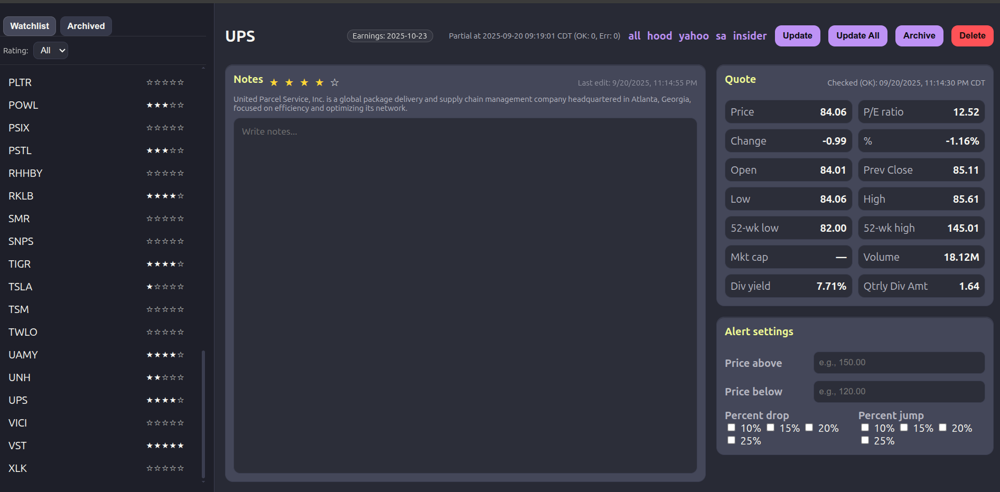

# Stock Alerts (FastAPI + SQLite + Minimal Frontend)

A **cheap, customizable, self-hosted stock alert system** built with **FastAPI + SQLite + vanilla JS frontend**.  
Instead of paying for expensive real-time feeds, this project experiments with using **ChatGPT** and **Gemini search engines** as alternative quote providers.
---

## Screenshots



---

## Goal

**Maximize flexibility while minimizing cost.**  
Track your tickers, write unlimited notes, and get timely alerts **without hitting API limits or paying for premium feeds.**

---

## Motivation

Traditional APIs like **Alpha Vantage** are reliable but limited (free tier = 25 requests/day).  
By contrast, ChatGPT/Gemini as “quote scrapers” are:

- 💸 **Cheaper** – no quota walls or costly subscriptions  
- ♾️ **Unlimited** – practically no daily cap  
- ✅ **Accurate enough** – tested error/missing-data rate <5%  
- 🔍 **More flexible** – can query richer stock info using custom prompts  

This makes it possible to run continuous stock tracking without API constraints while also experimenting with AI-driven insights.

---

## Key Features

- 📝 **Unlimited notes** per stock – write and save your own analysis directly in the app (a feature most platforms lack)  
- 🔔 **Discord notifications** – instant alerts in your server when conditions are met  
- ⚙️ **Custom alerts** – price above/below thresholds, % jump/drop, earnings reminders (configurable days in advance)  
- ⭐ **Ratings system** – 1–5 star ratings for quick sentiment tracking  
- 📈 **Trending view** – see stock momentum at a glance in the description area  
- 🧠 **AI-powered queries** – use `/quote_sources/gemini_*` or `/chatgpt_*` to fetch additional stock insights beyond traditional APIs  
- 🗂️ **Watch vs Archived groups** – organize your symbols neatly  
- 🔒 **Environment-driven config** – no secrets in repo, `.env` powered  
- 🐳 **Docker-ready** – easy to run with `docker-compose`  

---

## Quick start (Docker)

### 1. Download this project
```bash
git clone https://github.com/hngpham/stock-alerts.git
cd stock-alerts
```

## 2. Get an API key

You must configure **at least one quote provider**:

- **Alpha Vantage** – free 25 requests/day  
- **ChatGPT (OpenAI)** – supply your API key (optional alternative)  
- **Gemini (Google AI Studio)** – supply your key (optional alternative)  

Even though Alpha Vantage is the default, you can switch to ChatGPT or Gemini to avoid daily limits.

---

## 3. Configure `docker-compose.yml`

Open `docker-compose.yml` in a text editor and update:

- `ports:` → change to your preferred port if `8000` is taken  
- Add your API key(s) under `environment:`  

**Example:**
```yaml
  environment:
    ALPHA_VANTAGE_KEY: "your-alpha-key"
    OPENAI_API_KEY: "your-chatgpt-key"
    GEMINI_API_KEY: "your-gemini-key"
    QUOTE_PROVIDER: "alpha_vantage"   # or "chatgpt" / "gemini"
    DB_PATH: "/data/stocks.db"
    MARKET_TZ: "America/New_York"
```

## 4. Build and run

For the **first time** (or after editing `docker-compose.yml`):

```bash
docker compose build
docker compose up -d
```

---

## Architecture

- **Backend:** FastAPI, SQLite, APScheduler (`backend/`)  
- **Frontend:** static HTML/CSS/JS served by FastAPI (`frontend/`)  
- **Providers:** pluggable quote sources (`quote_sources/`)  
- **Storage:** SQLite database (`data/stocks.db`)  
